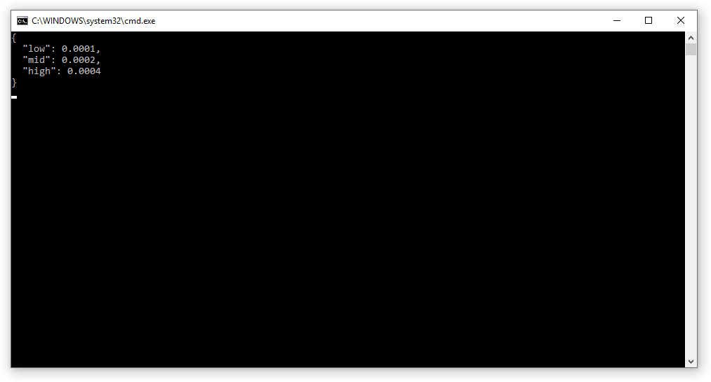

Audio Tester
------

This tester is just a console based C# application that takes in the JSON data on 239.0.0.222 port 2222 and converts it to a string, and finally prints it out.
This is useful to determine if your networking is configured properly.
