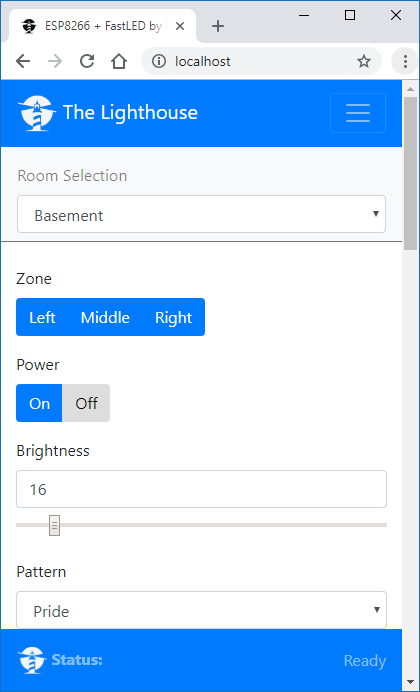

FastLED + ESP8266 + Dedicated Web Server
=========

Control an addressable LED strip with an ESP8266 via a web browser or infrared remote control.

Hardware Used
--------

##### ESP-01 development board

##### Addressable LED strip

Other hardware:

* [3.3V to 5V Logic Level Shifter](http://www.digikey.com/product-detail/en/texas-instruments/SN74HCT245N/296-1612-5-ND/277258) (required if LEDs "glitch")

Recommended by [Adafruit NeoPixel "Best Practices"](https://learn.adafruit.com/adafruit-neopixel-uberguide/best-practices) to help protect LEDs from current onrush:
* [1000µF Capacitor](http://www.digikey.com/product-detail/en/panasonic-electronic-components/ECA-1EM102/P5156-ND/245015)
* [300 to 500 Ohm resistor](https://www.digikey.com/product-detail/en/stackpole-electronics-inc/CF14JT470R/CF14JT470RCT-ND/1830342)

Features
--------
* Manage multiple Neopixel Strips
* Turn the NeoPixels on and off
* Adjust the brightness
* Change the display pattern
* Adjust the color

Web App
--------

Patterns are requested by the app from the ESP8266, so as new patterns are added, they're automatically listed in the app.

The web app is stored on the local server. The server files are found in the Web Server root directory.

The web app is a single page app that uses [jQuery](https://jquery.com) and [Bootstrap](http://getbootstrap.com).  It has buttons for On/Off, a slider for brightness, a pattern selector, and a color picker (using [jQuery MiniColors](http://labs.abeautifulsite.net/jquery-minicolors)).  Event handlers for the controls are wired up, so you don't have to click a 'Send' button after making changes.  The brightness slider and the color picker use a delayed event handler, to prevent from flooding the ESP8266 web server with too many requests too quickly.

By hosting on a local server, there is virtual no limitation to file size / app scalability, and changes are very easy to manage.

Installing
-----------
The app is installed via the Arduino IDE which can be [downloaded here](https://www.arduino.cc/en/main/software). The ESP8266 boards will need to be added to the Arduino IDE which is achieved as follows. Click File > Preferences and copy and paste the URL "http://arduino.esp8266.com/stable/package_esp8266com_index.json" into the Additional Boards Manager URLs field. Click OK. Click Tools > Boards: ... > Boards Manager. Find and click on ESP8266 (using the Search function may expedite this). Click on Install. After installation, click on Close and then select your ESP8266 board from the Tools > Board: ... menu.

The app depends on the following libraries. They must either be downloaded from GitHub and placed in the Arduino 'libraries' folder, or installed as [described here](https://www.arduino.cc/en/Guide/Libraries) by using the Arduino library manager.

* [FastLED](https://github.com/FastLED/FastLED)
* [Arduino WebSockets](https://github.com/Links2004/arduinoWebSockets)

Download the app code from GitHub using the green Clone or Download button from [the GitHub project main page](https://github.com/jasoncoon/esp8266-fastled-webserver) and click Download ZIP. Decompress the ZIP file in your Arduino sketch folder.

The web app needs to be uploaded to the ESP8266's SPIFFS.  You can do this within the Arduino IDE after installing the [Arduino ESP8266FS tool](http://esp8266.github.io/Arduino/versions/2.3.0/doc/filesystem.html#uploading-files-to-file-system).

With ESP8266FS installed upload the web app using `ESP8266 Sketch Data Upload` command in the Arduino Tools menu.

Then enter your wi-fi network SSID and password in the WiFi.h file, and upload the sketch using the Upload button.

REST Web services
-----------------

The firmware implements basic [RESTful web services](https://en.wikipedia.org/wiki/Representational_state_transfer) using the ESP8266WebServer library.  Current values are requested with HTTP GETs, and values are set with POSTs using query string parameters.  It can run in connected or standalone access point modes.

[Adafruit NeoPixel Ring]:https://www.adafruit.com/product/1586
[Adafruit HUZZAH ESP8266 Breakout]:https://www.adafruit.com/products/2471
