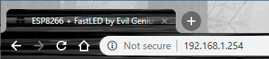

Dedicated Web Server
=========
Included in this folder is the setup and files for the dedicated webserver. Place this on your dedicated file serving pc along with the [Audio Server](https://github.com/Tiuipuv/esp8266-fastled-dedicated-webserver/tree/master/Audio%20Server). The goal of the dedicated web server is to centralize the experience for all of the microcontrollers, free up spiffs (allowing for a larger program), and allow for more complex webpages.

Setup
------
In order to use this webserver, you must have [node](https://nodejs.org/en/) installed on your system.
 

 
Once node is installed, you must add [express.js](https://expressjs.com/) using node package manager:

`npm install express`

After aquiring these, to run the server you can either use the .bat file and place it in the startup folder or run it manually by typing `node ./static_server.js` in the console.

Currently the ESP's expect the server to be at 192.168.1.254 (static ip), with each esp droping 1 below the last (.253, .252). Feel free to change this in [app.js](https://github.com/Tiuipuv/esp8266-fastled-dedicated-webserver/blob/master/Web%20Server/data/js/app.js) and the main sketch ino file. The server should serve the files in the data folder statically on port 80, allowing you to use the server by navigating to http://192.168.1.254 in your browser.

